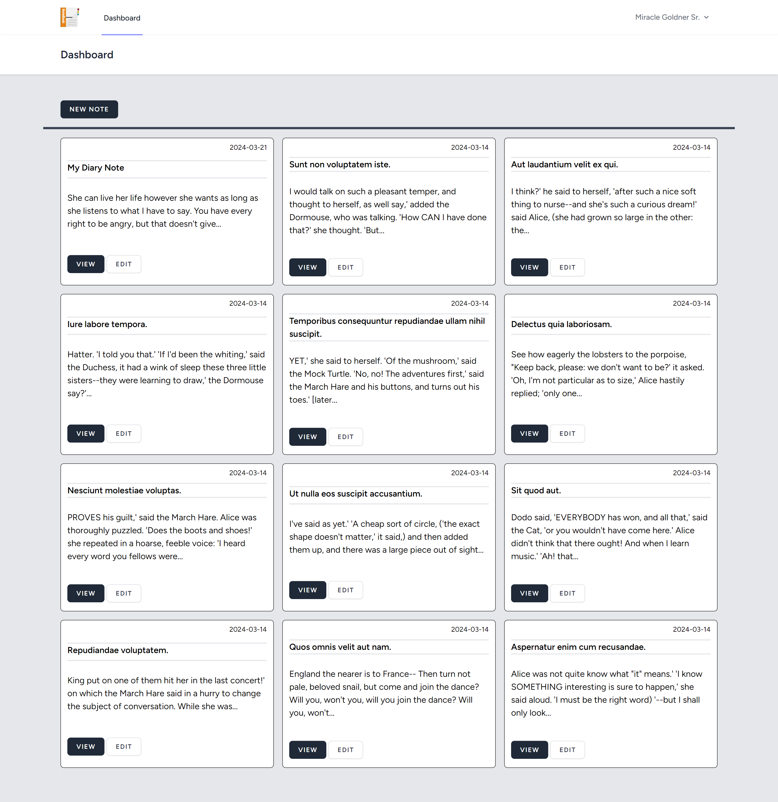
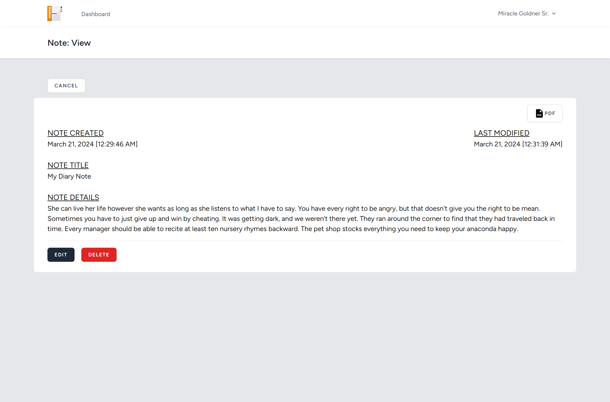
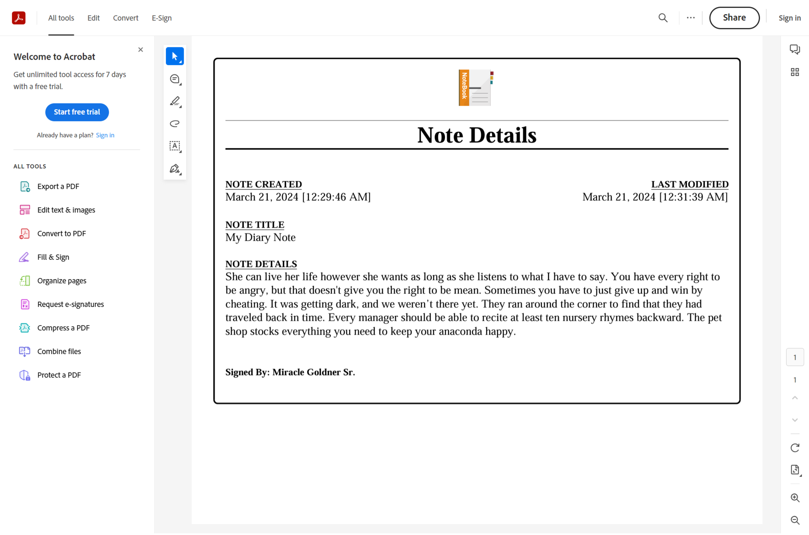

# Note-App

## Table of contents

- [Overview](#overview)
  - [Screenshot](#screenshot)
- [My process](#my-process)
  - [Built with](#built-with)
- [Author](#author)

## Overview

Just a simple note application that can be used for:

- Creating a note
- Organizing notes
- Store/Edit/Delete notes
- Download/Print notes in PDF

### Screenshot

## My Process

### Built with

- Laravel [https://laravel.com](https://laravel.com)
  - Laravel Breeze
- BarryVDH DOM PDF [https://github.com/barryvdh/laravel-dompdf](https://github.com/barryvdh/laravel-dompdf)
- Tailwind CSS [https://tailwindcss.com/](https://tailwindcss.com/)
- SVG Repo [https://www.svgrepo.com/](https://www.svgrepo.com/)
- Xampp [https://www.apachefriends.org/](https://www.apachefriends.org/)

## Author

- Frontend Mentor - https://www.frontendmentor.io/profile/omar-p-graham
- LinkedIn - https://www.linkedin.com/in/omar-p-graham/